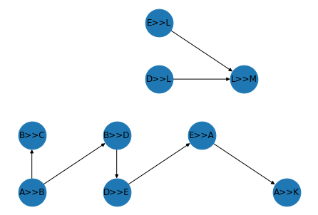

# FaSTMⱯN

## Follow all Suspicious Trails of Money for all Nodes
### The implementation is tailored for running things in a distributed and scalable way. With minimal changes the code can therefore, be executed on a massively large dataset.

The attached notebook [fastman.ipynb](./fastman.ipynb) contains the example dataset and the implementation for the following parts of FaSTM∀N:
* Temporal Graph Creation
* 2nd Order Graph Creation
* Weights Calculation
* Community Detection

```
! pip install matplotlib==3.4.3
! pip install networkx==2.6.3
! pip install pandas==1.4.1
! pip install pyspark==3.2.0
! pip install graphframes==0.6
! pip install leidenalg==0.9.1
```

## The Example Dataset and the Resulting Graphs


### Temporal Graph of Sequential Transactions


### Second Order Graph
#### NOTE: The weights will be calculated per distinct `moment`
#### This means, for instance, [t1]A>>B ---> [t3]A>>B ---> [t4]B>>C is counted once


### Detected Communities

